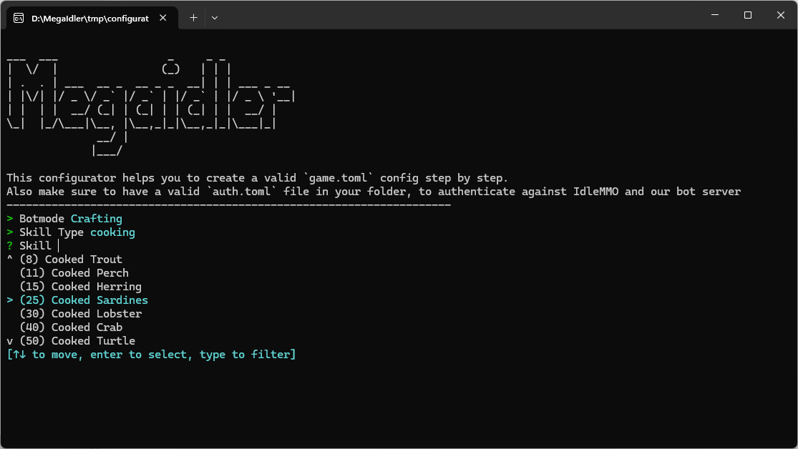

    
    <h3 align="center"> MegaIdler </h1>
    
 <i>the most advanced bot for the  <a href="https://www.idle-mmo.com/">IdleMMO</a> browsergame providing a fully automated gameplay experience. </i>

    

>*Megaidler is currently in a limited, **free** public testing phase.*  
>You can request a key in our public  server.  
>Follow the detailed steps to receive the `Trial` role.

## Modes
**Crafting**:  
The bot repeatedly crafts specified items (e.g., Tin Bar). It automatically detects missing materials (e.g., Tin Ore and Coal Ore) and either crafts or purchases them as needed.  

**Leveling**:  
Continuously levels up selected skills (e.g., woodcutting, forging). The bot autonomously gathers required materials. For example, when leveling cooking, it will automatically fish and mine coal ore when supplies run low. For fishing activities, it purchases necessary bait independently.  

**Battling**:  
Battles Enemies at a given location. The bot ensures that the character always carries enough Food to the fights and will start crafting if necessary.  

**Dungeon**:  
Indefinetely joins a given Expedition. The bot travels to the desired target location if the character is not there yet.  

## Configuration
The bot requires 2 configuration files:  
- `auth.toml`; authentication details for IdleMMO and MegaIdler. Edit the example file that comes with downloading the bot.
- `game.toml`; the actual bot configuration. Use the `configurator.exe` to create it

    

### Trial / License  
The bot is currently free to use while it's in the testing phase.  
Keys can be requested through 

### Download & Installation
**Windows**:  
Windows executables can be downloaded on the [Github Releases page](https://github.com/rusty-bob/MegaIdler/releases).  
If you need any other supported OS, please let me know.

**Docker**:  
https://hub.docker.com/repository/docker/megaidler/headless
